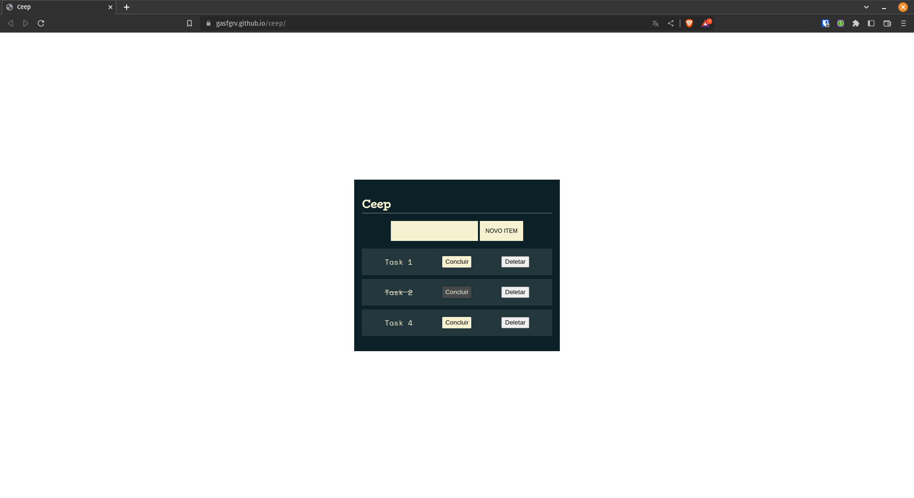

# ceep <!-- omit from toc -->

ToDo list feita no Curso de JS da alura.

## Tabela de Conteúdos<!-- omit from toc -->

- [Features](#features)
- [Tela da aplicação](#tela-da-aplicação)
- [Como usar](#como-usar)
- [Tecnologias usadas](#tecnologias-usadas)
- [Autor](#autor)

## Features

- [x] Inserir tarefas
- [x] Concluir tarefas
- [x] Deletar tarefas

## Tela da aplicação

## Como usar

- Acesse pelo link: https://gasfgrv.github.io/ceep/

## Tecnologias usadas

Esse app foi feito com Javascript, sem nenhum framework

## Autor

    
Feito por Gustavo Silva:

    
    
    
    

